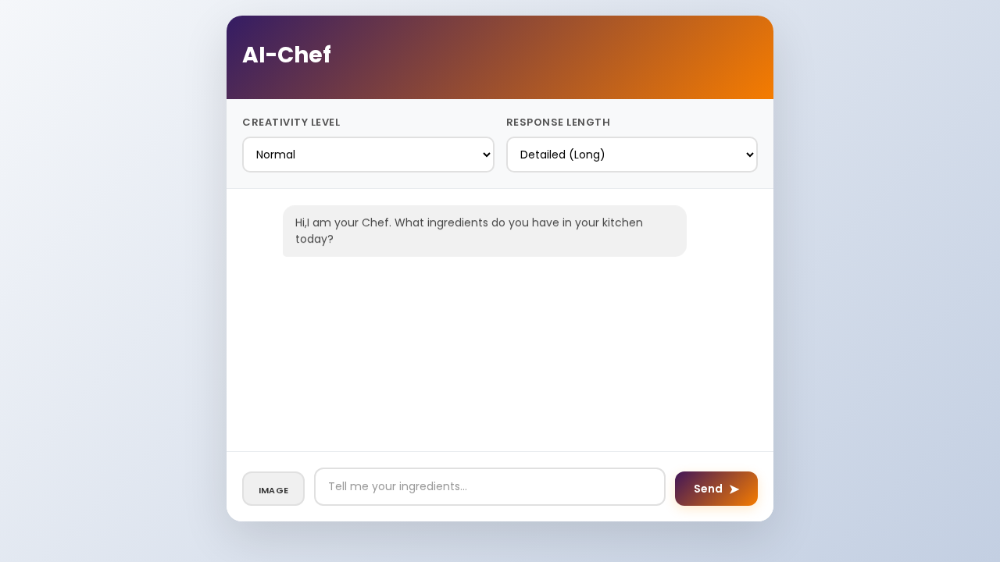
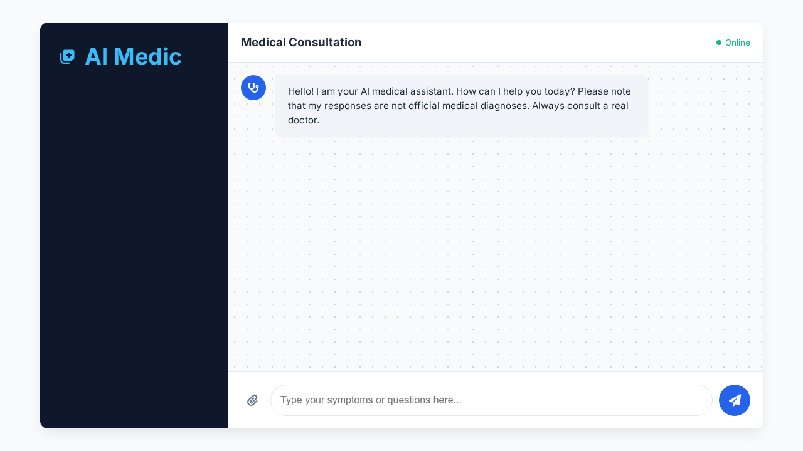
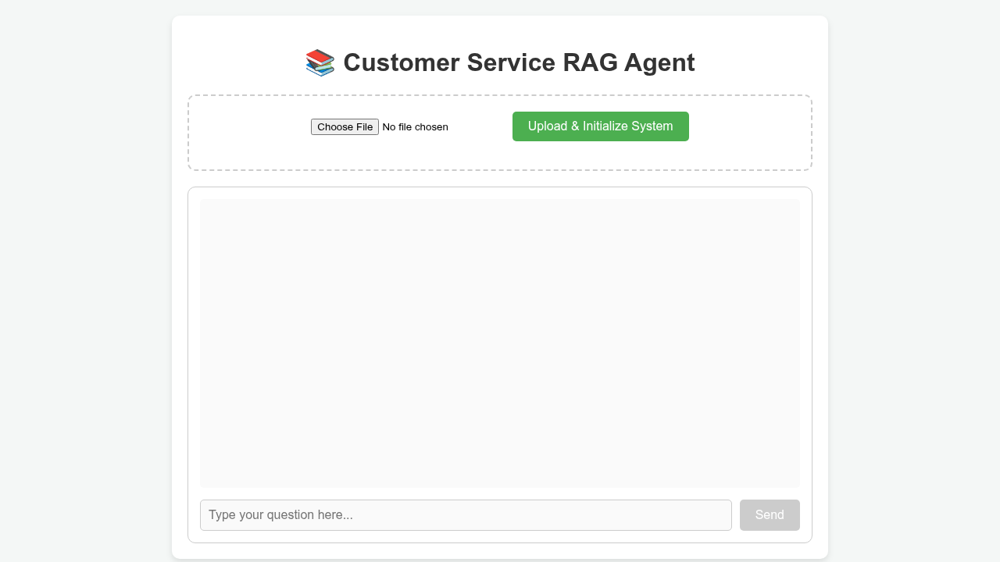

# Generative AI Labs - ITI

<div align="center">
  
  
  
  
</div>

Welcome to the Generative AI Labs repository! This project is a comprehensive collection of three distinct AI agent applications built to explore the capabilities of modern Large Language Models (LLMs) and advanced AI agent architectures. 

Throughout these labs, I built multi-modal chatbots, tool-calling agents with memory, and a fully functional Retrieval-Augmented Generation (RAG) pipeline to demonstrate real-world use cases of Generative AI.

## 🛠️ Overall Tech Stack & Tools Used
- **Language Frameworks:** Python 3, Flask (for serving the backend APIs and web interfaces).
- **AI/LLM Frameworks:** LangChain, LangGraph.
- **Models:** OpenAI GPT models (for text & vision), OpenAI Embeddings (`text-embedding-3-small`).
- **Vector Database:** Chroma (ChromaDB).
- **External Tools:** Tavily Search API.
- **Frontend:** HTML, CSS, JavaScript (Vanilla).

---

## 👨‍🍳 Lab 1: Multimodal Chef Chatbot

In this lab, I built an AI-powered culinary assistant that interacts with users through a custom web interface. It acts as a professional chef, providing recipes, cooking instructions, and nutritional analysis.

### Features:
- **Multimodal Inputs:** Users can send text prompts or upload images of ingredients/dishes for the AI to analyze.
- **Configurable LLM Parameters:** Users can adjust the creativity (temperature slider) and control the response length (concise vs. detailed).
- **Session Reset:** Easily clear the conversation context with a reset button.
- **Interactive UI:** A user-friendly chat interface for back-and-forth communication.

### Screenshot


---

## 🩺 Lab 2: Medical Diagnostic Agent with Memory

This lab focuses on building a highly capable, stateful Agent designed to act as an AI Doctor. The agent utilizes tool-calling capabilities to assist in diagnosing medical cases.

### Features:
- **Advanced State Management:** Utilized **LangGraph** to maintain conversation checkpoints (memory), allowing the agent to remember patient history, previous symptoms, and interactions across a continuous session (`web_session_01`).
- **External Web Search Tool:** Integrated with the **Tavily Search API**, allowing the agent to independently search the web for the latest medical data, side effects, or rare conditions when it needs more information to make a diagnosis.
- **Image Diagnosis:** Supports taking X-rays, MRIs, or visual symptom images alongside text to provide a better diagnostic response using OpenAI's vision capabilities.

### Screenshot


---

## 📚 Lab 3: Full RAG Pipeline (Retrieval-Augmented Generation)

In this lab, I developed a complete document-querying system from scratch. It allows users to upload complex PDF documents and ask questions about them, effectively bypassing the token limit of LLMs by using similarity search.

### Features:
- **PDF Ingestion & Processing:** Uses `PyPDFLoader` to extract text from documents.
- **Smart Text Splitting:** Utilizes LangChain's `RecursiveCharacterTextSplitter` to chunk the document into optimal sizes (400 chunk size / 80 overlap) for vectorization.
- **Embedding & Vector Storage:** Converts chunks into vector embeddings using OpenAI's `text-embedding-3-small` and stores them persistently in **ChromaDB**.
- **Context-Aware Q&A:** When a user asks a question, the backend queries the vector store to fetch relevant context and sends it to the LLM. It returns highly accurate answers along with the **source documents** it pulled the information from.

### Screenshot


---

## 🚀 How to Run Locally

1. **Clone the repository:**
   ```bash
   git clone https://github.com/Mostafa-Khalifaa/Gen-AI-RAG-AGINTIC-LABS.git
   cd Gen-AI-RAG-AGINTIC-LABS
   ```

2. **Set up Environment Variables:**
   Ensure you create `.env` files in each respective lab directory containing the required API keys:
   ```env
   OPENAI_API_KEY="your_openai_api_key"
   TAVILY_API_KEY="your_tavily_api_key" # Specifically for Lab 2
   ```

3. **Install Dependencies & Run a Lab:**
   ```bash
   # Navigate into any lab directory
   cd lab1  # or lab2, lab3
   
   # Create a virtual environment (optional but recommended)
   python -m venv .venv
   source .venv/bin/activate
   
   # Install requirements
   pip install -r requirements.txt
   
   # Run the application
   python app.py
   ```
   *The Flask web application will start locally and can be accessed at `http://127.0.0.1:5000/`.*
